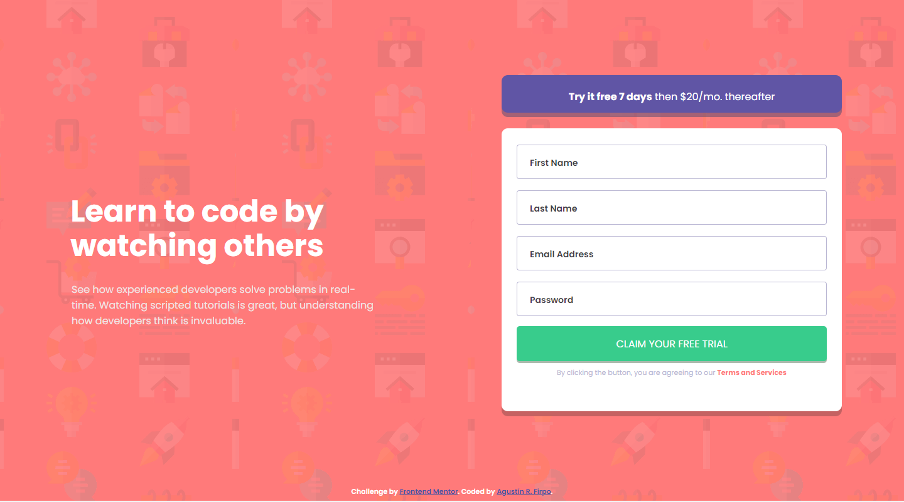
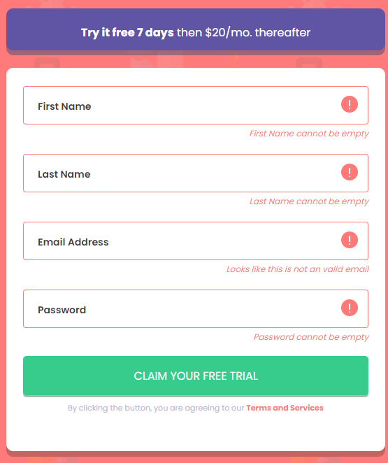
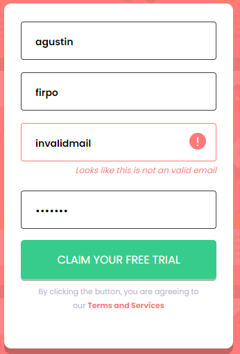
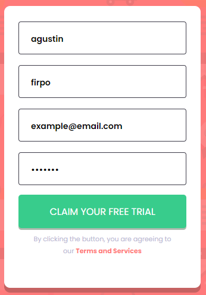

# Frontend Mentor - Intro component with sign up form solution

This is a solution to the [Intro component with sign up form challenge on Frontend Mentor](https://www.frontendmentor.io/challenges/intro-component-with-signup-form-5cf91bd49edda32581d28fd1). Frontend Mentor challenges help you improve your coding skills by building realistic projects.

## Table of contents

- [Overview](#overview)
  - [The challenge](#the-challenge)
  - [Screenshot](#screenshot)
  - [Links](#links)
- [My process](#my-process)
  - [Built with](#built-with)
  - [What I learned](#what-i-learned)
  - [Continued development](#continued-development)
  - [Useful resources](#useful-resources)
- [Author](#author)
- [Acknowledgments](#acknowledgments)

## Overview

### The challenge

Users should be able to:

- View the optimal layout for the site depending on their device's screen size
- See hover states for all interactive elements on the page
- Receive an error message when the `form` is submitted if:
  - Any `input` field is empty. The message for this error should say *"[Field Name] cannot be empty"*
  - The email address is not formatted correctly (i.e. a correct email address should have this structure: `name@host.tld`). The message for this error should say *"Looks like this is not an email"*

### Screenshot

### Links

- Solution URL: [Github - Repository](https://github.com/Arfirpo/intro-component-with-signup-form-master)
- Live Site URL: [Solution - Github Page](https://arfirpo.github.io/intro-component-with-signup-form-master/)

## My process

### Built with

- Semantic HTML5 markup
- HTML5 forms
- CSS custom properties
- Flexbox
- Mobile-first workflow
- Javascript
- Regular Expresions (js)

### What I learned

This challenge was an excellent opportunity to continue expanding my knowledge about the creation of html forms, their customization with CSS and the validation of the data entered in them with javascript.
This last section (functionality with js) was really difficult because my javascript management is still limited, so I learned and tried several functions and methods, which I did not know before, to achieve the final result.

### Continued development

From this challenge I would like to continue learning and practicing javascript functionalities to consolidate my knowledge in this programming language and give more solidity to the pages that I will create in the future.

### Useful resources

- [Regexr](https://www.example.com) - This page provided me with a regular expression to validate the emails in my code.

## Author

- Website - [Linkedin - Agustín R. Firpo](https://www.linkedin.com/in/agustin-rodrigo-firpo-0aa86697/)
- Frontend Mentor - [@Arfirpo](https://www.frontendmentor.io/profile/Arfirpo)

## Acknowledgments

 - This YouTube channel is very recomenadable to learn web development and was very useful for me in the realization of this challenge.
